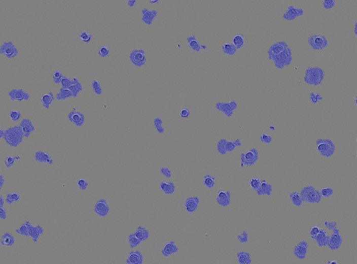

## *very minimal effort* Segnet and Unet for Cell segmentation (Livecell dataset)

## Method
The cell images and segmentation masks are splitted into small patches (both for generalisation and resource efficiency).

The Segmentation models are then trained on a patch-level. Inference is done by "stitching" the generated patch by patch segmentation masks.

## Results
Without hyperparameter tuning or efforts to increase performance, the baseline model acheives a train IOU and DICE of 0.44 and 0.59 respectively and test IOU and DICE of 0.52 and 0.61 respectively.

